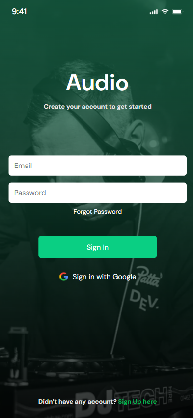
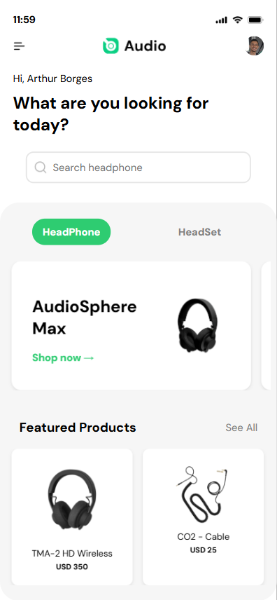
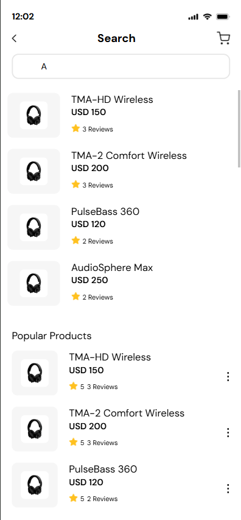
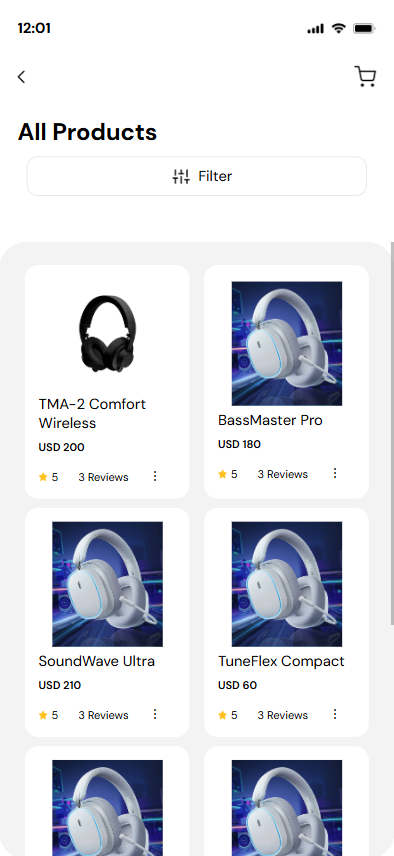

# Desafio E-Commerce Compass UOL

## Descrição
Este projeto é um desafio de e-commerce desenvolvido com React e TypeScript. Ele utiliza Firebase para autenticação e Firestore para armazenamento de dados. O projeto inclui várias páginas, como Home, Login, Cadastro e Search, e utiliza SCSS para estilização.

## Tecnologias Utilizadas
- React
- TypeScript
- Firebase (Autenticação e Firestore)
- SCSS
- Vite

## Layout
#### Figma: <https://www.figma.com/design/SasjEWI0wiQKBBzwyGE3eH/Desafio-Compass-Commerce---Arthur?node-id=4-1&t=VviUKr8QR7sSSY7n-1>

### Prints das Páginas
<div style="display: flex; flex-wrap: wrap;">
    
    
    
    
</div>

## Instalação
Para instalar as dependências do projeto, execute o seguinte comando:
```
npm install
```

## Uso
Para rodar o projeto, utilize o seguinte comando:
```
npm run dev
```

## Estrutura do Projeto
- `src`: Contém o código-fonte do projeto.
  - `components`: Componentes reutilizáveis do React.
  - `pages`: Páginas do projeto, como Home, Login, Cadastro e Search.
  - `hooks`: Hooks personalizados do React.
  - `img`: Imagens utilizadas no projeto.
  - `firebaseConfig.tsx`: Configuração do Firebase.
  - `App.tsx`: Componente principal do aplicativo.
  - `main.tsx`: Ponto de entrada do aplicativo.

